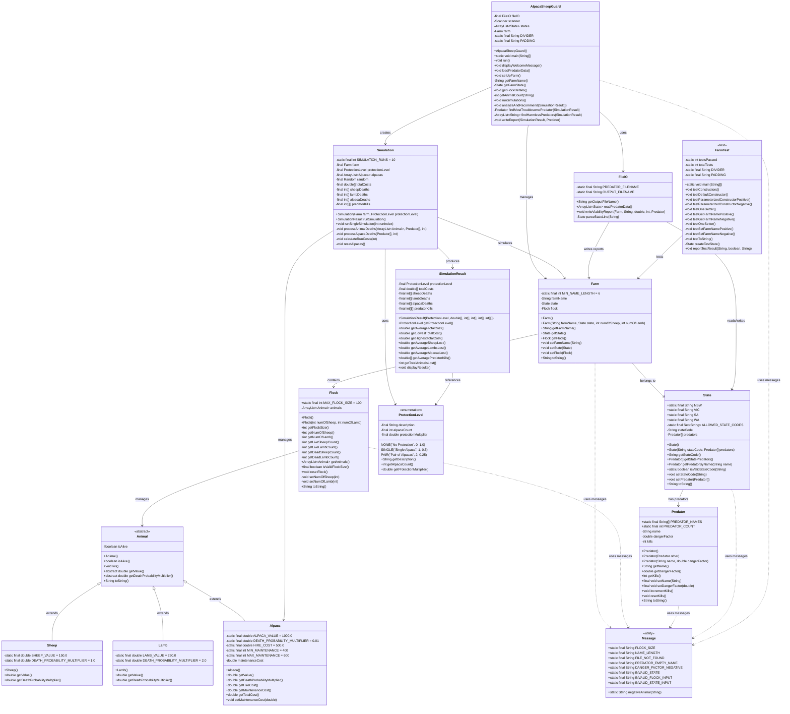

# FIT-9131 Assignment B Class Diagram

```mermaid
classDiagram

    class Animal {
        <<abstract>>
        #boolean isAlive
        +Animal()
        +boolean isAlive()
        +void kill()
        +abstract double getValue()
        +abstract double getDeathProbabilityMultiplier()
        +String toString()
    }

    class Sheep {
        -static final double SHEEP_VALUE = 150.0
        -static final double DEATH_PROBABILITY_MULTIPLIER = 1.0
        +Sheep()
        +double getValue()
        +double getDeathProbabilityMultiplier()
    }

    class Lamb {
        -static final double LAMB_VALUE = 250.0
        -static final double DEATH_PROBABILITY_MULTIPLIER = 2.0
        +Lamb()
        +double getValue()
        +double getDeathProbabilityMultiplier()
    }

    class Alpaca {
        -static final double ALPACA_VALUE = 1000.0
        -static final double DEATH_PROBABILITY_MULTIPLIER = 0.01
        -static final double HIRE_COST = 500.0
        -static final int MIN_MAINTENANCE = 400
        -static final int MAX_MAINTENANCE = 600
        -double maintenanceCost
        +Alpaca()
        +double getValue()
        +double getDeathProbabilityMultiplier()
        +double getHireCost()
        +double getMaintenanceCost()
        +double getTotalCost()
        +void setMaintenanceCost(double)
    }


    class Flock {
        +static final int MAX_FLOCK_SIZE = 100
        -ArrayList~Animal~ animals
        +Flock()
        +Flock(int numOfSheep, int numOfLamb)
        +int getFlockSize()
        +int getNumOfSheep()
        +int getNumOfLamb()
        +int getLiveSheepCount()
        +int getLiveLambCount()
        +int getDeadSheepCount()
        +int getDeadLambCount()
        +ArrayList~Animal~ getAnimals()
        +final boolean isValidFlockSize()
        +void resetFlock()
        -void setNumOfSheep(int)
        -void setNumOfLamb(int)
        +String toString()
    }


    class Predator {
        +static final String[] PREDATOR_NAMES
        +static final int PREDATOR_COUNT
        -String name
        -double dangerFactor
        -int kills
        +Predator()
        +Predator(Predator other)
        +Predator(String name, double dangerFactor)
        +String getName()
        +double getDangerFactor()
        +int getKills()
        +final void setName(String)
        +final void setDangerFactor(double)
        +void incrementKills()
        +void resetKills()
        +String toString()
    }


    class State {
        +static final String NSW
        +static final String VIC
        +static final String SA
        +static final String WA
        -static final Set~String~ ALLOWED_STATE_CODES
        -String stateCode
        -Predator[] predators
        +State()
        +State(String stateCode, Predator[] predators)
        +String getStateCode()
        +Predator[] getStatePredators()
        +Predator getPredatorByName(String name)
        +static boolean isValidStateCode(String)
        +void setStateCode(String)
        +void setPredator(Predator[])
        +String toString()
    }


    class Farm {
        -static final int MIN_NAME_LENGTH = 6
        -String farmName
        -State state
        -Flock flock
        +Farm()
        +Farm(String farmName, State state, int numOfSheep, int numOfLamb)
        +String getFarmName()
        +State getState()
        +Flock getFlock()
        +void setFarmName(String)
        +void setState(State)
        +void setFlock(Flock)
        +String toString()
    }


    class ProtectionLevel {
        <<enumeration>>
        NONE("No Protection", 0, 1.0)
        SINGLE("Single Alpaca", 1, 0.5)
        PAIR("Pair of Alpacas", 2, 0.25)
        -final String description
        -final int alpacaCount
        -final double protectionMultiplier
        +String getDescription()
        +int getAlpacaCount()
        +double getProtectionMultiplier()
    }


    class Simulation {
        -static final int SIMULATION_RUNS = 10
        -final Farm farm
        -final ProtectionLevel protectionLevel
        -final ArrayList~Alpaca~ alpacas
        -final Random random
        -final double[] totalCosts
        -final int[] sheepDeaths
        -final int[] lambDeaths
        -final int[] alpacaDeaths
        -final int[][] predatorKills
        +Simulation(Farm farm, ProtectionLevel protectionLevel)
        +SimulationResult runSimulation()
        +void runSingleSimulation(int runIndex)
        -void processAnimalDeaths(ArrayList~Animal~, Predator[], int)
        -void processAlpacaDeaths(Predator[], int)
        -void calculateRunCosts(int)
        -void resetAlpacas()
    }

    class SimulationResult {
        -final ProtectionLevel protectionLevel
        -final double[] totalCosts
        -final int[] sheepDeaths
        -final int[] lambDeaths
        -final int[] alpacaDeaths
        -final int[][] predatorKills
        +SimulationResult(ProtectionLevel, double[], int[], int[], int[], int[][])
        +ProtectionLevel getProtectionLevel()
        +double getAverageTotalCost()
        +double getLowestTotalCost()
        +double getHighestTotalCost()
        +double getAverageSheepLost()
        +double getAverageLambsLost()
        +double getAverageAlpacasLost()
        +double[] getAveragePredatorKills()
        +int getTotalAnimalsLost()
        +void displayResults()
    }


    class FileIO {
        -static final String PREDATOR_FILENAME
        -static final String OUTPUT_FILENAME
        +String getOutputFileName()
        +ArrayList~State~ readPredatorData()
        +void writeViabilityReport(Farm, String, double, int, Predator)
        -State parseStateLine(String)
    }


    class AlpacaSheepGuard {
        -final FileIO fileIO
        -Scanner scanner
        -ArrayList~State~ states
        -Farm farm
        -static final String DIVIDER
        -static final String PADDING
        +AlpacaSheepGuard()
        +static void main(String[])
        +void run()
        -void displayWelcomeMessage()
        -void loadPredatorData()
        -void setUpFarm()
        -String getFarmName()
        -State getFarmState()
        -void getFlockDetails()
        -int getAnimalCount(String)
        -void runSimulations()
        -void analyzeAndRecommend(SimulationResult[])
        -Predator findMostTroublesomePredator(SimulationResult)
        -ArrayList~String~ findHarmlessPredators(SimulationResult)
        -void writeReport(SimulationResult, Predator)
    }


    class Message {
        <<utility>>
        +static final String FLOCK_SIZE
        +static final String NAME_LENGTH
        +static final String FILE_NOT_FOUND
        +static final String PREDATOR_EMPTY_NAME
        +static final String DANGER_FACTOR_NEGATIVE
        +static final String INVALID_STATE
        +static final String INVALID_FLOCK_INPUT
        +static final String INVALID_STATE_INPUT
        +static String negativeAnimal(String)
    }

    class FarmTest {
        <<test>>
        -static int testsPassed
        -static int totalTests
        -static final String DIVIDER
        -static final String PADDING
        +static void main(String[])
        -void testConstructors()
        -void testDefaultConstructor()
        -void testParameterizedConstructorPositive()
        -void testParameterizedConstructorNegative()
        -void testOneGetter()
        -void testGetFarmNamePositive()
        -void testGetFarmNameNegative()
        -void testOneSetter()
        -void testSetFarmNamePositive()
        -void testSetFarmNameNegative()
        -void testToString()
        -State createTestState()
        -void reportTestResult(String, boolean, String)
    }

    Animal <|-- Sheep : extends
    Animal <|-- Lamb : extends
    Animal <|-- Alpaca : extends

    Farm --> Flock : contains
    Farm --> State : belongs to
    Flock --> Animal : manages
    State --> Predator : has predators
    
    AlpacaSheepGuard --> Farm : manages
    AlpacaSheepGuard --> FileIO : uses
    AlpacaSheepGuard --> Simulation : creates
    
    Simulation --> Farm : simulates
    Simulation --> ProtectionLevel : uses
    Simulation --> Alpaca : manages
    Simulation --> SimulationResult : produces
    
    FileIO --> State : reads/writes
    FileIO --> Farm : writes reports
    SimulationResult --> ProtectionLevel : references
    FarmTest --> Farm : tests
    
    Farm ..> Message : uses messages
    Flock ..> Message : uses messages
    Predator ..> Message : uses messages
    State ..> Message : uses messages
    AlpacaSheepGuard ..> Message : uses messages
```
